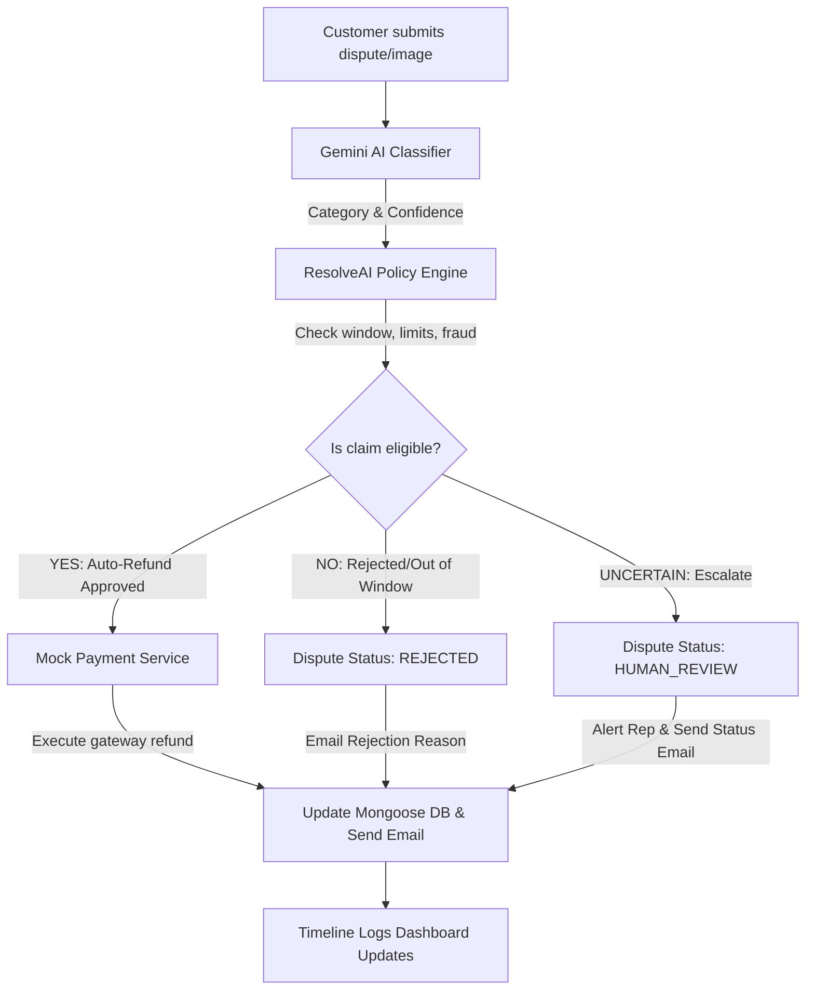

# ResolveAI - Autonomous E-Commerce Payment Dispute Resolution Platform

> "From customer dispute to resolution — automatically."

ResolveAI is a production-oriented hackathon MVP designed to automate the customer payment and order dispute resolution lifecycle. Using Google Gemini AI, ResolveAI eliminates administrative overhead by parsing complaints, verifying database ledgers, validating safety boundaries, and executing instant payment gateway actions without human manual intervention.

---

## Architecture Flow



---

## Features

- **Gemini AI Classification**: Analyzes complaint description texts and classifies them into structured categories with confidence metrics.
- **Multimodal AI Image Analysis**: Evaluates photographic evidence for damaged product claims using Gemini's visual analysis.
- **Centralized Policy Engine**: Assesses disputes against return window timelines (7 days), maximum auto-refund limits, and duplicate payment counts.
- **Modular Payment Abstraction**: Clear service interfaces enabling mock test modes in Phase 1, easily swappable with Razorpay APIs in future iterations.
- **Dynamic Audit Timelines**: AutomationLog models capture and expose every decision step live to customer and admin dashboards.
- **Nodemailer SMTP Fallback**: Sends email alerts dynamically, printing logs to stdout if credentials are not configured.

---

## Tech Stack

- **Frontend**: HTML5, Vanilla CSS3 (custom CSS design systems, no Tailwind), Vanilla JavaScript.
- **Backend**: Node.js, Express.js.
- **Database**: MongoDB & Mongoose.
- **AI Integration**: Official Google Generative AI SDK (`@google/generative-ai`).
- **File Uploads & Storage**: Multer memory buffer handling, unified local disk storage or Cloudinary integrations.
- **Email Service**: Nodemailer.
- **Deployment**: Render-compatible web services profile.

---

## Folder Structure

```
resolveai/
├── server/
│   ├── app.js                 # Express Application
│   ├── server.js              # Server Listener
│   ├── config/                # Environment, DB & AI init
│   ├── models/                # Mongoose Database Schemas
│   ├── routes/                # API Endpoints
│   ├── controllers/           # Route Controllers
│   ├── services/              # AI, Payment, Storage, Email Services
│   ├── middleware/            # Auth, Error & Logger middlewares
│   └── seed/                  # Seeding scenarios script
├── public/                    # Frontend files
│   ├── index.html             # Store Front Home
│   ├── pages/                 # Customer & Admin pages
│   ├── css/                   # Global, Component stylesheets
│   └── js/                    # API client wrappers
├── uploads/                   # Local uploads directory
├── render.yaml                # Render Blueprint setup
├── .env.example               # Template environment configuration
└── package.json               # Package setup & dependencies
```

---

## Local Setup

### 1. Prerequisite Installations
- Node.js (v18+)
- MongoDB running locally or an Atlas connection string.

### 2. Configuration Environment
Create a `.env` file in the root directory:
```env
PORT=5000
MONGODB_URI=mongodb://localhost:27017/resolveai
GEMINI_API_KEY=your_gemini_api_key
GEMINI_MODEL=gemini-2.0-flash-lite

# Storage (set type to 'cloudinary' or defaults to 'local')
STORAGE_TYPE=local
CLOUDINARY_CLOUD_NAME=
CLOUDINARY_API_KEY=
CLOUDINARY_API_SECRET=

# Admin Login details
ADMIN_EMAIL=admin@resolveai.com
ADMIN_PASSWORD=adminpassword123

# SMTP Email (Optional, mock logger fallback active if empty)
SMTP_HOST=
SMTP_PORT=587
SMTP_USER=
SMTP_PASS=
EMAIL_FROM=noreply@resolveai.com
```

### 3. Database Seeding
Execute the database seed script to populate products and test cases:
```bash
npm run seed
```

### 4. Running Application
Start the backend listener in development mode:
```bash
npm run dev
```
Open `http://localhost:5000` on your browser to access the storefront.

---

## Core Demo Workflows

### Scenario 1: Double Charge (Primary Auto-Refund Demo)
1. Navigate to "My Orders" on the header menu.
2. Select **View Order Details** on the top order (seeded duplicate payments mock).
3. Scroll down and click **Report a Problem / File Dispute**.
4. Type: `"I was charged twice for this order."` and click **VERIFY & RESOLVE**.
5. The analyzing progress screen polls the logs, processes the refund, and displays the success screen showing **₹1499 refunded**.

### Scenario 2: Expired Refund Claim (Rejection Policy Demo)
1. Go to "My Orders" and click details on the webcam purchase (ordered 19 days ago).
2. Open dispute form and submit: `"I would like to request a refund for this webcam."`.
3. The resolving agent runs the return window policy check and rejects the claim automatically because it exceeds the 7-day limit.

---

## Render Deployment

To deploy ResolveAI directly on Render:
1. Connect your repository to Render.
2. Use the `render.yaml` blueprint.
3. Supply the environment variables `MONGODB_URI` and `GEMINI_API_KEY` in the Render dashboard settings.
