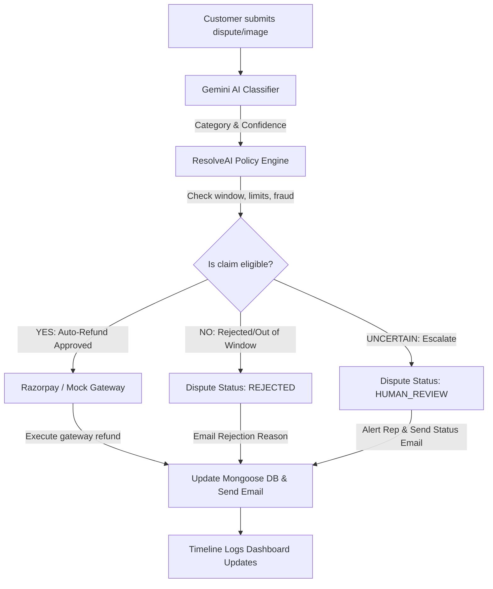

# ResolveAI - Autonomous E-Commerce Payment Dispute Resolution Platform

> "From customer dispute to resolution — automatically."

ResolveAI is a production-oriented hackathon MVP designed to automate the customer payment and order dispute resolution lifecycle. Using Google Gemini AI, ResolveAI eliminates administrative overhead by parsing complaints, verifying database ledgers, validating safety boundaries, and executing instant payment gateway actions without human manual intervention.

---

## Architecture Flow



---

## Key Features

- **Gemini AI Classification**: Analyzes complaint description texts and classifies them into structured categories with confidence metrics.
- **Multimodal AI Image Analysis**: Evaluates photographic evidence for damaged product claims using Gemini's visual analysis.
- **Zero-Shot Fraud Verification**: Gemini cross-references uploaded photos with the exact expected item description from order records to catch mismatch fraud (e.g. keyboard photo uploaded for mouse claims).
- **Centralized Policy Engine**: Assesses disputes against return window timelines (configurable in `.env`), maximum auto-refund limits, and duplicate payment counts.
- **Individual Line-Item Claims**: Customers can file disputes for specific items in a bulk order. Auto-refund eligibility and refund payments are calculated proportionally for that item.
- **Dynamic Dispute Status Dashboard**: Replaces general file-complaint buttons with live status tracking boards when claims are active.
- **Razorpay Gateway Integration**: Seamless checkout and instant gateway refunds for verified claims.
- **Multi-Tier Rate Limiting & Helmet Headers**: Enforces strict endpoint security, content security policies (CSP), and clickjacking/MIME sniffing protections.
- **Google Firebase Authentication**: Secure sign-in and sign-up flows for customers.

---

## Tech Stack

- **Frontend**: HTML5, Vanilla CSS3 (custom CSS design systems, no Tailwind), Vanilla JavaScript.
- **Backend**: Node.js, Express.js.
- **Database**: MongoDB & Mongoose.
- **AI Integration**: Official Google Generative AI SDK (`@google/generative-ai`).
- **File Uploads & Storage**: Multer memory buffer handling, unified local disk storage or Cloudinary integrations.
- **Payment Gateway**: Razorpay APIs.
- **Email Service**: Nodemailer SMTP fallback.
- **Deployment**: Render-compatible web services profile.

---

## Folder Structure

```
resolveai/
├── server/
│   ├── app.js                 # Express Application
│   ├── server.js              # Server Listener
│   ├── config/                # Environment, DB & AI init
│   ├── models/                # Mongoose Database Schemas
│   ├── routes/                # API Endpoints
│   ├── controllers/           # Route Controllers
│   ├── services/              # AI, Payment, Storage, Email Services
│   ├── middleware/            # Auth, Error & Logger middlewares
│   └── seed/                  # Seeding scenarios script
├── public/                    # Frontend files
│   ├── index.html             # Store Front Home
│   ├── pages/                 # Customer & Admin pages
│   ├── css/                   # Global, Component stylesheets
│   └── js/                    # API client wrappers
├── uploads/                   # Local uploads directory
├── render.yaml                # Render Blueprint setup
├── .env.example               # Template environment configuration
└── package.json               # Package setup & dependencies
```

---

## Local Setup

### 1. Prerequisite Installations
- Node.js (v18+)
- MongoDB running locally or an Atlas connection string.

### 2. Configuration Environment
Create a `.env` file in the root directory:
```env
PORT=5000
MONGODB_URI=mongodb://localhost:27017/resolveai
GEMINI_API_KEY=your_gemini_api_key
GEMINI_MODEL=gemini-2.0-flash-lite

# Storage (set type to 'cloudinary' or defaults to 'local')
STORAGE_TYPE=local
CLOUDINARY_CLOUD_NAME=
CLOUDINARY_API_KEY=
CLOUDINARY_API_SECRET=

# Admin Login details
ADMIN_EMAIL=admin@resolveai.com
ADMIN_PASSWORD=adminpassword123

# SMTP Email (Optional, mock logger fallback active if empty)
SMTP_HOST=smtp.gmail.com
SMTP_PORT=587
SMTP_USER=your_email@gmail.com
SMTP_PASS=your_app_password
EMAIL_FROM=noreply@resolveai.com

# Razorpay Integration
RAZORPAY_KEY_ID=rzp_test_xxxxxx
RAZORPAY_KEY_SECRET=xxxxxx

# Policy Configuration
RETURN_WINDOW_DAYS=7
AUTO_REFUND_LIMIT=10000
```

### 3. Database Seeding
Execute the database seed script to populate products and test cases:
```bash
npm run seed
```

### 4. Running Application
Start the backend listener in development mode:
```bash
npm run dev
```
Open `http://localhost:5000` on your browser to access the storefront.

---

## Core Demo Workflows

### Scenario 1: Double Charge (Primary Auto-Refund Demo)
1. Go to "My Orders" and click **Details** on the top order.
2. Under general payment issues, click **Report Double Charge or Billing Issue**.
3. Submit: `"I was charged twice for this order."`
4. The timeline logs poll, approve the duplicate claim, execute the refund, and show success.

### Scenario 2: Proportional Refund Claim (Damaged Item)
1. Go to "My Orders" and open the bulk order details.
2. Next to your item, click **Request Refund**.
3. Upload a photo showing physical damage of the correct item and submit.
4. Gemini verifies the image contents against the expected product, checks return policies, and executes a proportional partial refund for that item.
